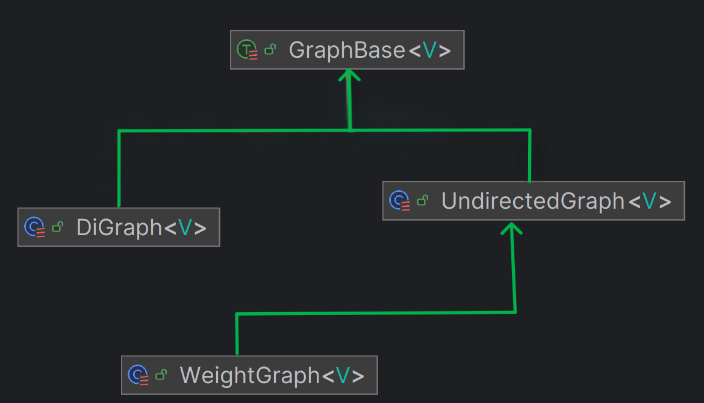
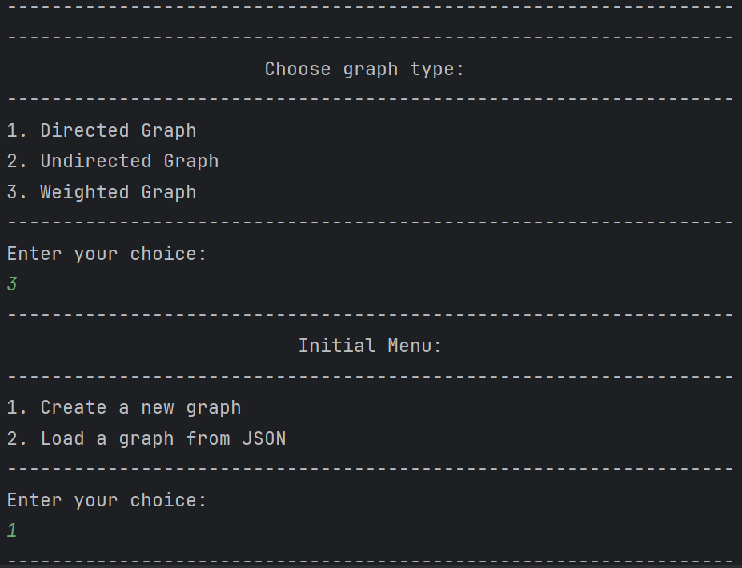
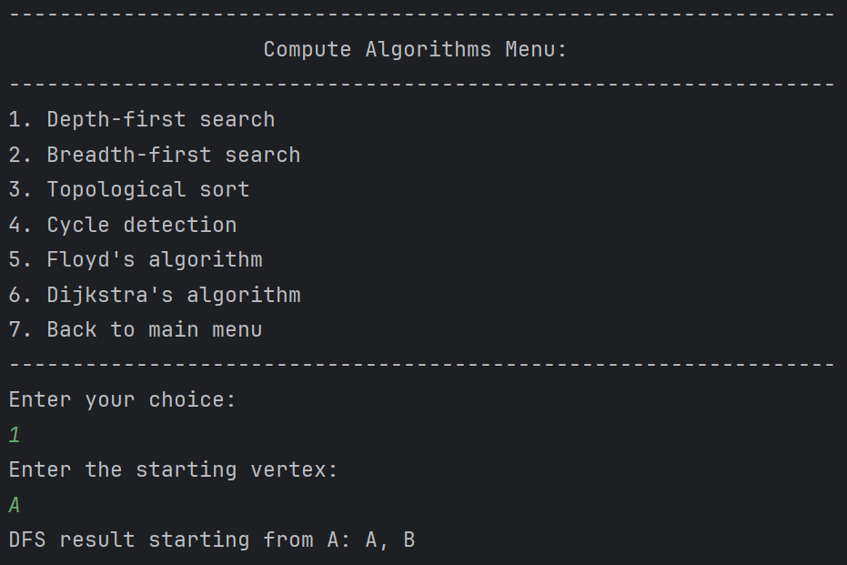
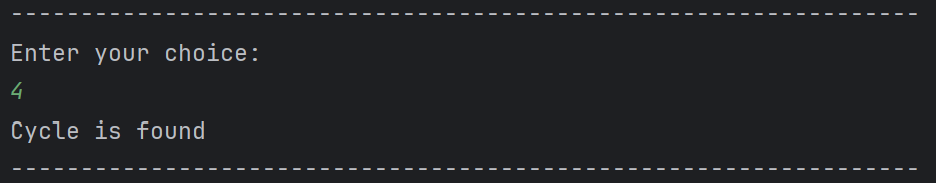
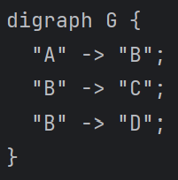
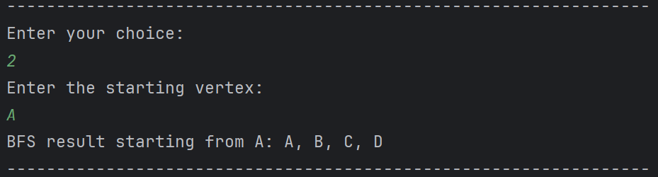
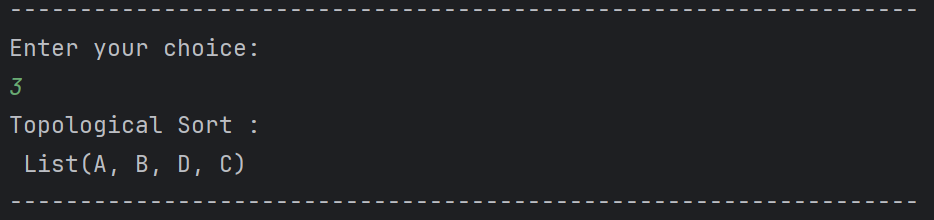
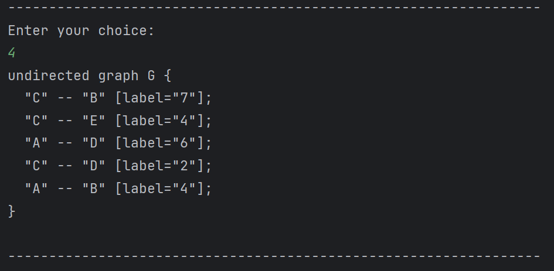
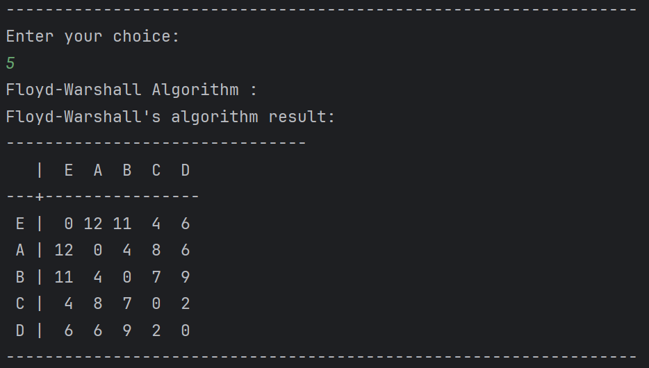
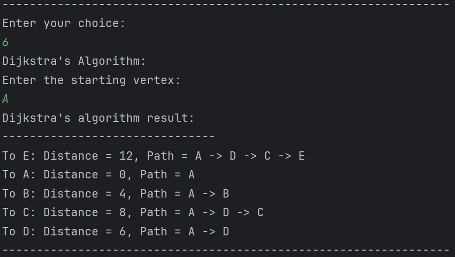

# scala-graph

## ***[Subject link](./INSTRUCTIONS.md)***

## Overview

The project is a Scala Zio app that allows users to create graphs, perform operations, and visualize results.
Our graph library is integrated into a ZIO 2 application as an interactive command-line tool.
The project offers various algorithms for graph operations, such as depth-first search, cycle detection, and Dijkstra's algorithm. (see [Tasks](#tasks))

The use has the possibility to create graphs, by adding edges or load a json file containing the graph.
Samples of graphs are provided in the `resources` folder. (as example too)

## Instructions

### Run the app

To run the app, use the following command:

```bash
sbt app/run
```

**if you are on IntelliJ IDEA**: you can run the `GraphApp` object directly. (in the app subproject)

### Run the tests

To run the tests, use the following command:

```bash
sbt test
```

## Design

### Subprojects

We divided the project into two subprojects:

- `core`: contains the graph library
- `app`: contains the ZIO application and the tests

### Core

#### Graphs



There is a common trait `GraphBase` that defines the basic operations for a graph. All the graph types extends this trait.
Directed graph and Undirected graph are separated into two different case classes and, in this simulation, we decided to set Weighted graphs as Undirected graphs with weights.

Each graph type has its own implementation of the `GraphBase` methods. This way, the operations are more efficient and the code is more readable.

Graphs are parameterized by the type of the vertices, so we can create graphs with any type of vertices.

#### Graph Operations

We created, for more clarity, a trait containing all the operations that can be performed on a graph. And this trait is extended by the `GraphOperationsImpl`.

### App

#### Tests

We created tests for each graph algorithms. We used the `FlatSpec` library for testing. More details in the [Tests](#tests) section.

#### Command interface app

The app is a simple command-line interface that allows users to create graphs, perform operations, and visualize results.



The user follows a set of instructions to create a graph, perform operations, and visualize the results.

### State Management

For this application, we chose a simple state management approach where the graph state
is passed and returned in each operation. This approach is sufficient for our current needs
and keeps the code straightforward.

For a more complex application, we would consider using ZIO Ref for managing mutable state
within ZIO, or ZIO Layer for dependency injection and more sophisticated state management.
These approaches would offer better scalability and testability as the application grows.

## Usage

### Algorithms

#### Depth-first search

The depth-first search algorithm is implemented for undirected, directed, and weighted graphs.



#### Cycle detection

The cycle detection algorithm is implemented for undirected, directed, and weighted graphs.



#### Breadth-first search

The breadth-first search algorithm is implemented for undirected, directed, and weighted graphs.

Example of a BFS on a directed graph:





#### Topological sort

The topological sort algorithm is implemented for directed graphs.

Example of a topological sort on the same graph as above:



#### Floyd's algorithm

Floyd's algorithm is implemented for weighted graphs only.





#### Dijkstra's algorithm

Dijkstra's algorithm is implemented for weighted graphs only.

Example of Dijkstra's algorithm on the same graph as above:



## Tests

We created tests for each graph algorithm. We used the `FlatSpec` library for testing.

Tests are in the `app` subproject, and we created one class per algorithm. And all the tests are run with the command `sbt test` in the root folder.

## Tasks

- [x] Datastructures
- [x] Base Methods (get vertices, edges, neighbors, addEdge, removeEdge)
- [x] Types of graphs (directed, undirected, weighted)
- [x] JSON encoding/decoding
- [x] GraphViz display
- [x] Graph algorithms
  - [x] Depth-first search (Undirected, Directed, Weighted)
  - [x] Breadth-first search (Undirected, Directed, Weighted)
  - [x] Topological sort (Directed)
  - [x] Cycle detection (Undirected, Directed, Weighted)
  - [x] Floyd's algorithm (Weighted)
  - [x] Dijkstra's algorithm (Weighted)
- [x] App (ZIO)
- [ ] Logging (Optional)
- [ ] Readme